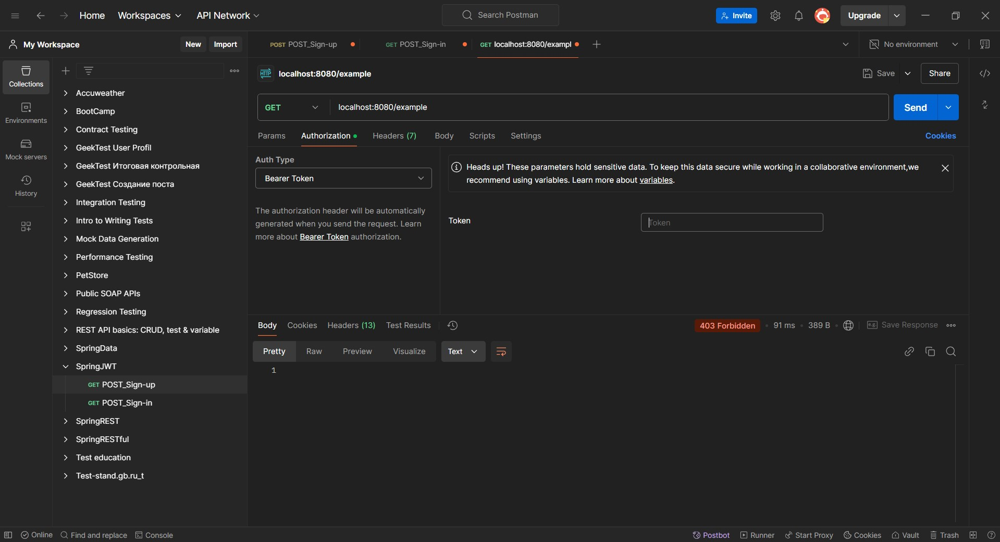
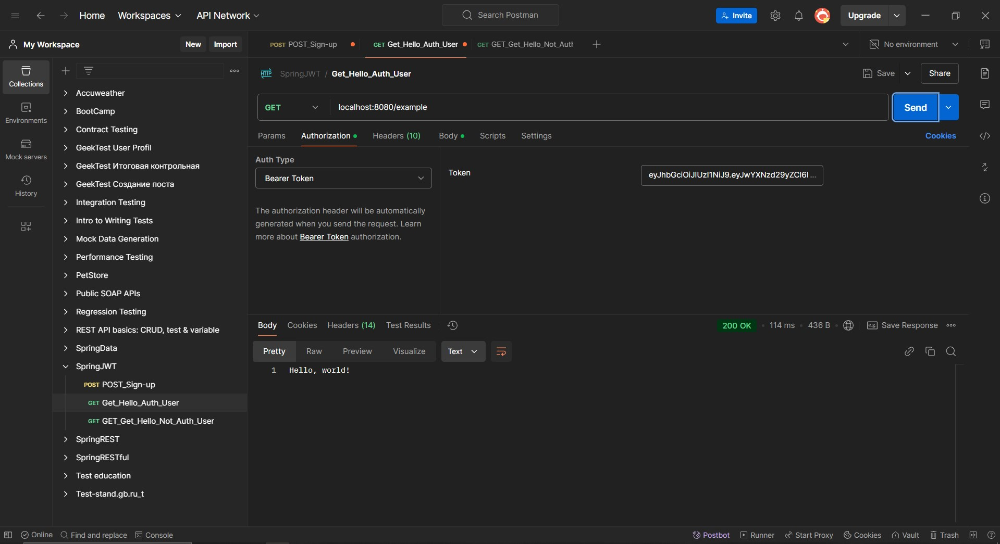
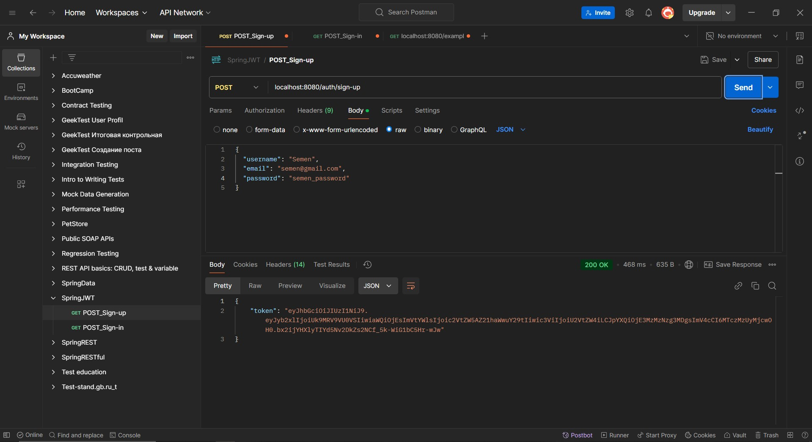
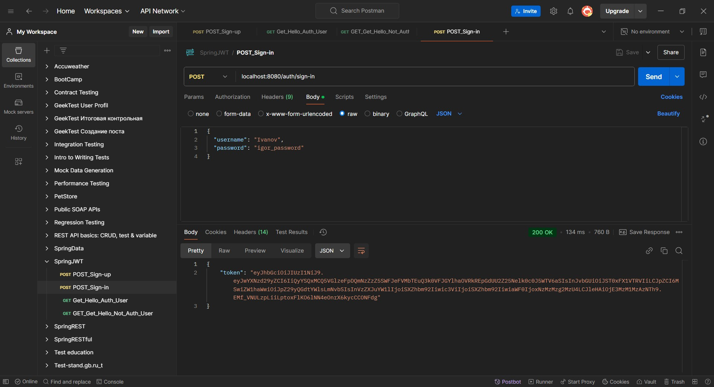

# Урок 7. Spring Security. Работа с JWT. Защита от основных видов атак.

Задание: 
Используя Spring Security, добавьте аутентификацию и авторизацию в ваше приложение. 
Реализуйте генерацию и валидацию JWT-токенов.

==================================================================================

## Демонстрация решения:

### Доступ к приветствию без токена:

### Доступ к приветствию с токеном:

### Получение токена при регистрации:

### Получение токена при авторизации:

